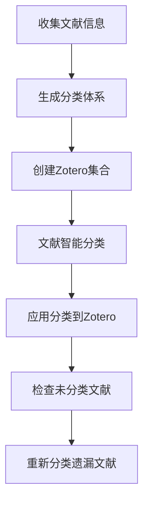

# Zotero LLM Classify - 智能文献分类系统

[](https://www.python.org/downloads/)
[](https://opensource.org/licenses/MIT)
[](https://github.com/psf/black)

> 🧠 基于大语言模型的智能Zotero文献分类系统，自动分析文献内容并创建合理的分类体系

## 📖 项目简介

Zotero LLM Classify 是一个智能文献管理系统，利用大语言模型（LLM）自动分析Zotero库中的文献内容，生成合理的分类体系，并将文献智能分类到相应的集合中。

### ✨ 核心特性

- 🤖 **AI驱动分类**: 使用LLM（Gemini/OpenAI）智能分析文献标题和摘要
- 🏗️ **自动生成分类体系**: 基于文献内容自动创建合理的分类结构
- 📚 **Zotero深度集成**: 直接操作Zotero API，无缝集成现有工作流
- 🔄 **批量处理**: 支持大批量文献的智能分类
- 🛡️ **安全操作**: 只添加新分类，不删除现有分类关系
- ⚙️ **灵活配置**: 统一的配置管理系统，支持多种LLM服务
- 📊 **详细报告**: 生成分类计划和执行报告
- 🔒 **强制参数**: 所有文件路径必须明确指定，避免隐式默认值

### 🎯 适用场景

- 学术研究者需要整理大量文献
- 图书馆管理员需要建立文献分类体系
- 研究生需要管理研究资料
- 任何需要智能文献分类的场景

## 🚀 快速开始

### 环境要求

- Python 3.8+
- Zotero账户和API密钥
- LLM API密钥（Gemini或OpenAI）

### 安装步骤

1. **克隆项目**
   ```bash
   git clone https://github.com/your-username/zotero-llm-classify.git
   cd zotero-llm-classify
   ```

2. **安装依赖**
   ```bash
   # 使用uv（推荐）
   uv sync
   
   # 或使用pip
   pip install -r requirements.txt
   ```

3. **配置环境**
   ```bash
   # 创建配置文件
   python setup_config.py create
   
   # 交互式配置
   python setup_config.py setup
   
   # 验证配置
   python setup_config.py validate
   ```

4. **运行示例**
   ```bash
   # 测试模式（需要指定输入文件）
   python 005_generate_schema_and_create_collections.py --test --input data/literature_info.xlsx
   ```

## 📋 使用流程

### 完整工作流程



### 详细步骤

#### 1. 生成分类体系 (005)
```bash
# 测试模式 - 使用少量文献生成分类体系
python 005_generate_schema_and_create_collections.py --test --input data/literature_info.xlsx

# 第一步：生成分类体系文件（安全操作）
python 005_generate_schema_and_create_collections.py --generate-schema --input data/literature_info.xlsx

# 第二步：创建Zotero集合（危险操作）
python 005_generate_schema_and_create_collections.py --create-collections --schema data/classification_schema_ready.json

# 限制处理文献数量
python 005_generate_schema_and_create_collections.py --generate-schema --input data/literature_info.xlsx --max-items 100
```

#### 2. 文献智能分类 (006)
```bash
# 生成分类计划
python 006_reclassify_with_new_schema.py --plan --schema data/schema_with_collection_keys.json --input data/literature_info.xlsx

# 测试模式
python 006_reclassify_with_new_schema.py --test --schema data/schema_with_collection_keys.json --input data/literature_info.xlsx

# 指定批量大小
python 006_reclassify_with_new_schema.py --plan --schema data/schema_with_collection_keys.json --input data/literature_info.xlsx --batch-size 25

# 限制处理数量
python 006_reclassify_with_new_schema.py --plan --schema data/schema_with_collection_keys.json --input data/literature_info.xlsx --max-items 50
```

#### 3. 应用分类到Zotero (007)
```bash
# 测试模式应用
python 007_apply_classification_to_zotero.py --plan data/classification_plan.json --test

# 全量应用
python 007_apply_classification_to_zotero.py --plan data/classification_plan.json

# 限制处理数量
python 007_apply_classification_to_zotero.py --plan data/classification_plan.json --max-items 100
```

#### 4. 检查遗漏文献 (008)
```bash
# 检查并导出未分类文献（JSON格式）
python 008_check_and_export_missing_proper_items.py --output-format json

# 检查并导出未分类文献（Excel格式）
python 008_check_and_export_missing_proper_items.py --output-format excel

# 限制检查数量
python 008_check_and_export_missing_proper_items.py --limit 1000 --output-format json
```

## ⚙️ 配置系统

### 环境变量配置

项目使用统一的配置管理系统，所有配置都通过环境变量或`.env`文件管理：

```bash
# LLM配置
LLM_API_TYPE=gemini-direct
GEMINI_API_KEY=your_gemini_api_key
LLM_RPM_LIMIT=5

# Zotero配置
ZOTERO_USER_ID=your_user_id
ZOTERO_API_KEY=your_api_key

# 处理配置
DEFAULT_BATCH_SIZE=50
DEFAULT_TEST_ITEMS=10
```

### 配置工具

```bash
# 创建配置文件
python setup_config.py create

# 交互式配置
python setup_config.py setup

# 验证配置
python setup_config.py validate

# 迁移旧配置
python migrate_config.py
```

详细配置说明请参考：[配置指南](docs/CONFIGURATION_GUIDE.md)

## 📁 项目结构

```
zotero-llm-classify/
├── 📄 核心脚本
│   ├── 005_generate_schema_and_create_collections.py  # 生成分类体系
│   ├── 006_reclassify_with_new_schema.py             # 文献智能分类
│   ├── 007_apply_classification_to_zotero.py         # 应用分类到Zotero
│   └── 008_check_and_export_missing_proper_items.py  # 检查遗漏文献
├── 🔧 配置系统
│   ├── config.py                                      # 配置管理
│   ├── setup_config.py                                # 配置工具
│   ├── migrate_config.py                              # 配置迁移
│   └── env.example                                    # 环境变量模板
├── 📚 文档
│   ├── README.md                                      # 项目说明
│   ├── CONFIGURATION_GUIDE.md                         # 配置指南
│   └── PROJECT_STRUCTURE.md                           # 项目结构
├── 📊 数据目录
│   └── data/                                          # 数据文件存储
├── 🧪 测试
│   └── tests/                                         # 测试文件
└── 📦 依赖管理
    ├── requirements.txt                               # Python依赖
    └── pyproject.toml                                 # 项目配置
```

## 🔧 核心组件

### 1. SchemaBasedCollectionManager (005)
- **功能**: 基于LLM分析文献生成分类体系
- **特点**: 支持两步操作（生成schema、创建集合）、自动校验
- **输出**: 分类体系JSON文件

### 2. NewSchemaLiteratureClassifier (006)
- **功能**: 使用新分类体系对文献进行智能分类
- **特点**: 批量处理、多分类推荐、结果验证
- **输出**: 分类计划JSON文件

### 3. ClassificationApplier (007)
- **功能**: 安全地将分类结果应用到Zotero
- **特点**: 只添加不删除、版本控制、错误处理
- **输出**: 执行报告

### 4. MissingItemsChecker (008)
- **功能**: 检查未分类的标准文献类型
- **特点**: 支持多种文献类型、摘要提取、多种输出格式
- **输出**: 遗漏文献列表

## 🎨 分类示例

### 生成的分类体系
```json
{
  "main_categories": {
    "[AUTO] Artificial Intelligence": {
      "description": "AI相关研究，包括机器学习、深度学习、神经网络等",
      "subcategories": {
        "Machine Learning": "机器学习算法、模型、应用",
        "Deep Learning": "深度学习、神经网络、CNN/RNN",
        "Natural Language Processing": "自然语言处理、文本分析"
      }
    },
    "[AUTO] Computer Science": {
      "description": "计算机科学基础研究",
      "subcategories": {
        "Algorithms": "算法设计、复杂度分析",
        "Data Structures": "数据结构、存储优化",
        "Software Engineering": "软件工程、开发方法"
      }
    }
  }
}
```

### 分类结果
```json
{
  "item_key": "ABC123",
  "title": "Attention Is All You Need",
  "abstract": "We propose a new simple network architecture...",
  "recommended_collections": ["ML_001", "NLP_002"],
  "reasoning": "该论文主要研究Transformer架构，属于机器学习和自然语言处理领域"
}
```

## 🔍 高级功能

### 批量处理
- 支持大批量文献的智能分类
- 可配置的批量大小
- 进度显示和错误处理

### 多分类推荐
- 每篇文献可推荐多个分类
- 置信度评分
- 避免分类冲突

### 安全操作
- 只添加新分类，不删除现有分类
- 版本控制确保数据一致性
- 详细的执行日志

### 结果验证
- 自动验证分类结果的有效性
- 检查collection keys的正确性
- 生成验证报告

### Schema自动校验
- LLM生成的schema自动验证
- 检查命名规范、结构完整性
- 防止不合格schema流入后续步骤

## 🛠️ 开发指南

### 环境设置
```bash
# 创建虚拟环境
python -m venv venv
source venv/bin/activate  # Linux/Mac
# 或
venv\Scripts\activate     # Windows

# 安装开发依赖
pip install -r requirements.txt
```

### 代码规范
- 使用Black进行代码格式化
- 遵循PEP 8编码规范
- 添加类型注解
- 编写详细的文档字符串

### 测试
```bash
# 运行测试
python -m pytest tests/

# 运行特定测试
python -m pytest tests/test_auto_classify.py
```

## 📊 性能优化

### 批量处理优化
- 根据LLM API限制调整批量大小
- 使用并发处理提高效率
- 实现请求缓存减少重复调用

### 成本控制
- 监控token使用量
- 优化prompt长度
- 使用更高效的模型

### 错误处理
- 实现重试机制
- 详细的错误日志
- 优雅的失败处理

## 🔒 安全特性

### 强制参数传递
- 所有文件路径必须明确指定
- 避免隐式默认值带来的风险
- 提高操作的可追踪性

### 参数验证
- 严格的参数验证机制
- 文件存在性检查
- 清晰的错误提示

### 操作确认
- 危险操作需要用户确认
- 测试模式支持
- 详细的执行预览

## 🤝 贡献指南

### 提交代码
1. Fork项目
2. 创建功能分支
3. 提交更改
4. 创建Pull Request

### 报告问题
- 使用GitHub Issues
- 提供详细的错误信息
- 包含复现步骤

### 功能建议
- 在Issues中提出建议
- 讨论实现方案
- 参与代码审查

## 📄 许可证

本项目采用MIT许可证 - 查看 [LICENSE](LICENSE) 文件了解详情。

## 🙏 致谢

- [Zotero](https://zotero.org/) - 优秀的文献管理工具
- [Google Gemini](https://ai.google.dev/) - 强大的AI模型
- [OpenAI](https://openai.com/) - 领先的AI技术
- 所有贡献者和用户

## 📞 联系方式

- 项目主页: [GitHub Repository](https://github.com/your-username/zotero-llm-classify)
- 问题反馈: [GitHub Issues](https://github.com/your-username/zotero-llm-classify/issues)
- 邮箱: your-email@example.com

---

⭐ 如果这个项目对你有帮助，请给它一个星标！ 